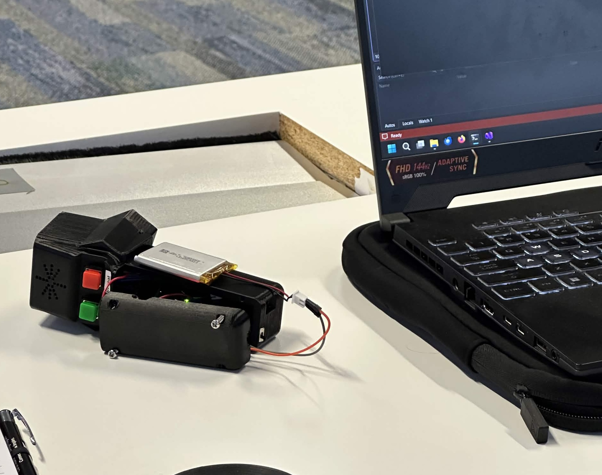
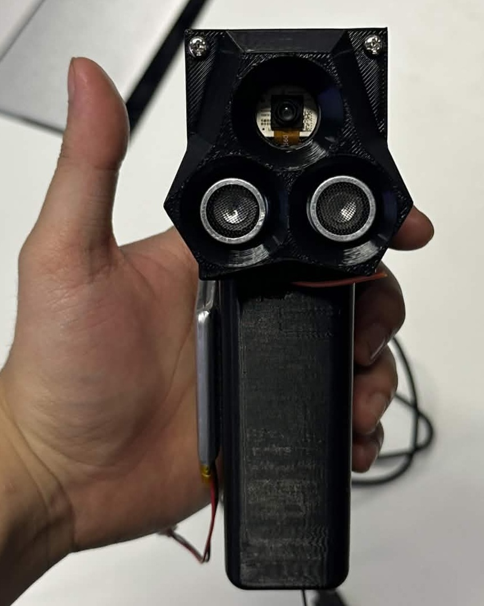
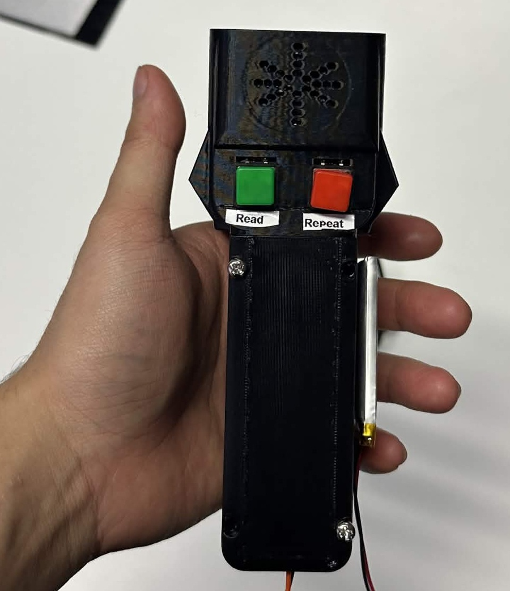

# Handheld Text Reader

## Introduction

A project I undertook alongside current (as of writing) software engineering and electrical engineering students, as part of the WA Data Science Innovation Hub (WADSIH) 2026 Hardware Hack hackathon, with the intended goal of creating an assistive technology to better support the independence and dignity of someone living with a disability.

As of writing I have not included the names of my team members, as it did not feel appropriate to share this information here without explicit consent.

Additionally, this is the first "big" project I've added to this website and I'm still working out how I want to structure these, it might be a bit messy at first and may be subject to change later.

## Overview

For this project, we created a handheld device using an ESP32 that will, on button press, take a photo and read aloud any text identified within the photo, with the added functionality of being able to repeat the last recorded phrase on a separate button press.

Due to the hardware limitations of the ESP32, we decided to move some of the logic onto a separate server which our device could then communicate with, which I was responsible for the creation of. I wrote the server and accompanying API in C# using ASP.NET and Blazor, primarily due to past familiarity.

Upon receiving an image from our device, the server would transcribe any text from the image, run it through a text to speech model and return the resulting audio as a .wav file. 
Image transcription was done using Google's Gemma 4-32b ai model, accessed via OpenRouter using a key provided to us by WADSIH for this Hackathon, to read any text contained with an image or return a predefined error string in the event no legible text is found. Received images are encoded in base64 so as to be able to send them in a request to the OpenRouter API.

Converting any transcribed text to audio was done locally using [KokoroSharp](https://github.com/Lyrcaxis/KokoroSharp), with the resulting audio only ever kept temporarily in memory and sent back to our ESP32. I did this so as to alleviate any potential privacy concerns (i.e. reading something sensitive like a form) and to minimise storage usage on the server host machine.

Additionally, I wrote the client side logic for communicating with our server and assisted with refactoring and repairing the code in `main.cpp` on the ESP32.

## Images

{eleventy:widths="900"}

    
    

## Source

[ASP.NET server & API repository](https://github.com/Frosk-Kristian/HH-2026-WebServer) -- a vast majority of my contributions to the project may be found here, this is my own work and I did not use ai to generate any code

[ESP32 source code](https://github.com/Samh006/2026_HH) -- most of my contribution to this repository is in the `client.cpp` class and `client.h` header, as a disclaimer the team member primarily responsible for the ESP32 relied heavily on Claude and this repository contains ai generated code (I cannot verfiy how much was ai generated and how much was written by a person, beyond checking commit authors)
